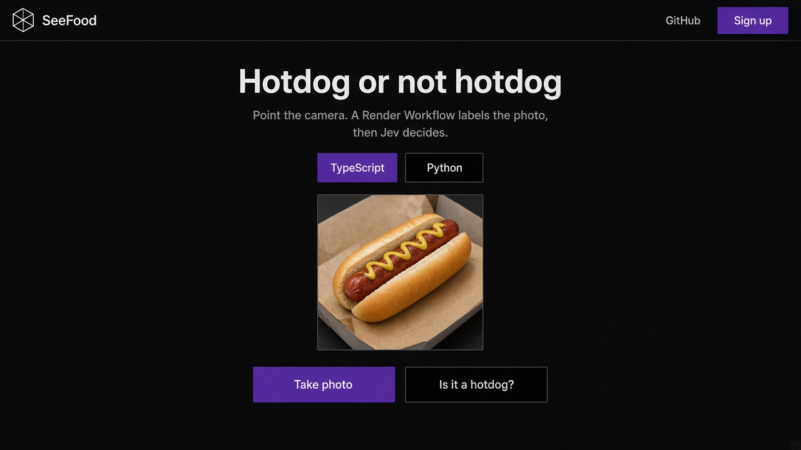
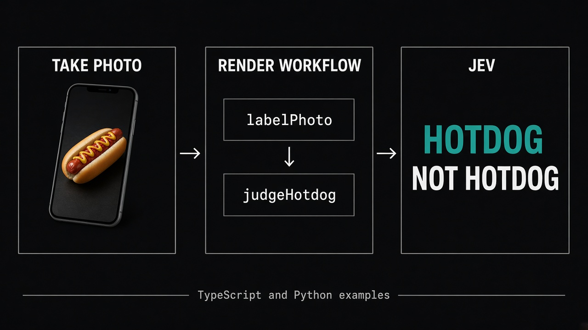
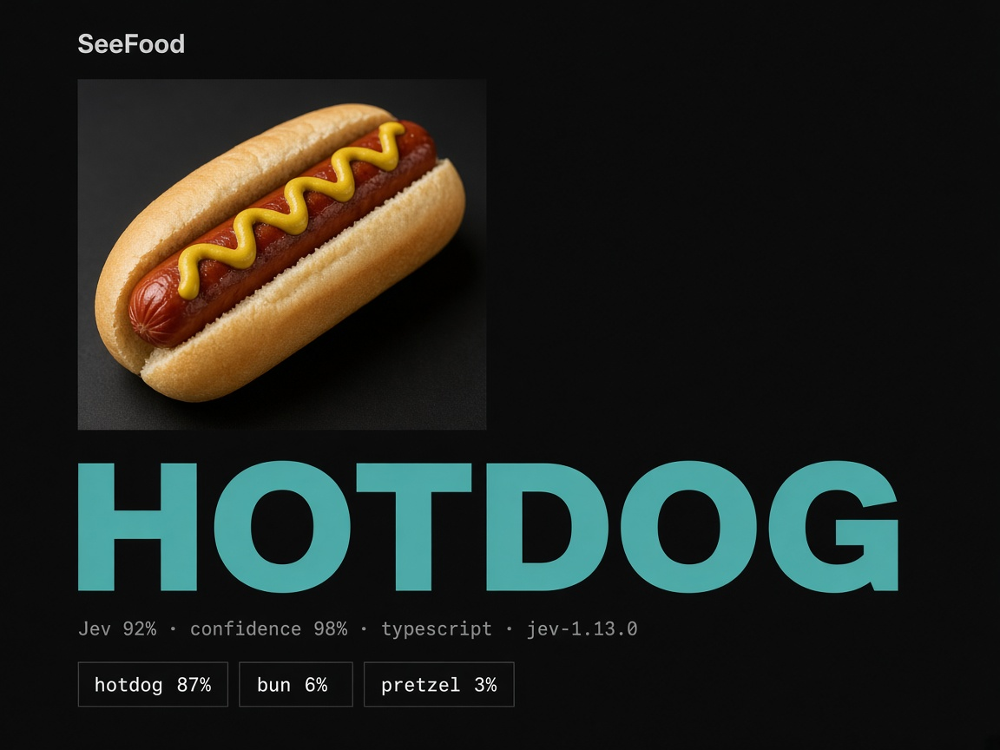
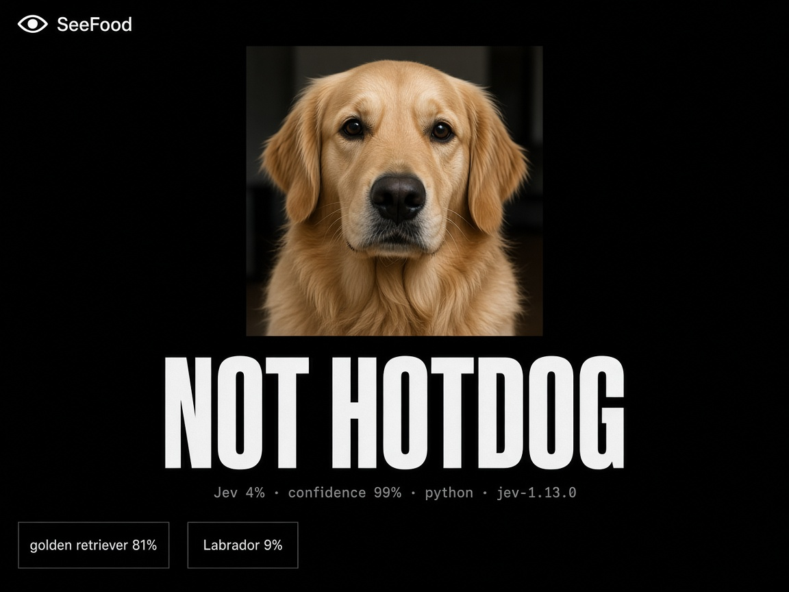

# SeeFood

Take a photo. **Render Workflows** labels it, then **TypeSafe Jev** says HOTDOG or NOT HOTDOG.

| Example | Code and deploy | Try |
| --- | --- | --- |
| TypeScript |  | <a href="https://seefood-6wov.onrender.com" target="_blank" rel="noopener noreferrer">Live app</a> |
| Python |  | Same UI, Python workflow |

Each example deploys its own web service and workflow. They share the SeeFood UI.

## How it works

Jev is text-only. It never sees the photo.

1. The web app sends the image to the `seeFood` workflow.
2. **`labelPhoto`** runs a local ImageNet SqueezeNet ONNX model on the workflow instance and returns top labels (`hotdog`, `bagel`, …).
3. **`judgeHotdog`** sends those labels to Jev. Jev returns `hotdog` or `not_hotdog`.
4. The UI shows **HOTDOG** or **NOT HOTDOG**, plus the live Render task tree.

| HOTDOG | NOT HOTDOG |
| --- | --- |
|  |  |

## Deploy

The Blueprint creates a web service and a workflow. Enter a **Render API key** on the web service and a **TypeSafe API key** on the workflow when prompted.

- TypeScript: `render.yaml` on `main` (`web` + `workflow-ts`)
- Python: `render.yaml` on the `python` branch (`web` + `workflow-py`)

## Related

<a href="https://github.com/ojusave/beat-jev" target="_blank" rel="noopener noreferrer">Beat Jev</a> · <a href="https://github.com/ojusave/route-lab" target="_blank" rel="noopener noreferrer">Route Lab</a>
